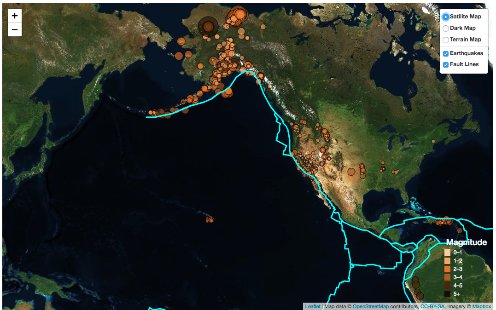

# Visualization_Leaflet

Create a map using Leaflet that plots all of the earthquakes from your data set based on their longitude and latitude.
* Data markers reflect the magnitude of the earthquake in their size and color. Earthquakes with higher magnitudes appear larger and darker in color.
* Popups provide additional information about the earthquake when a marker is clicked.
* The legend provides context for the map data.
* Here's the final output:

